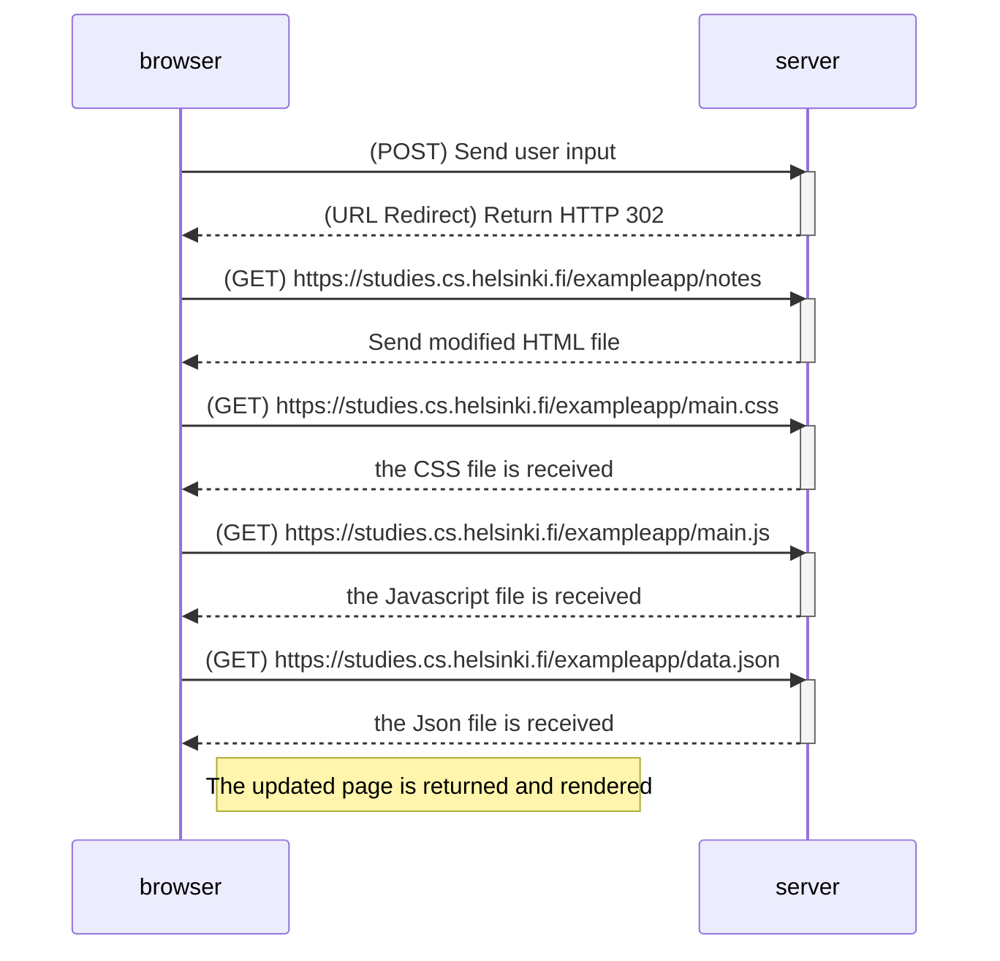

```mermaid
sequenceDiagram
participant browser
participant server

    browser->>server: (POST) Send user input
    activate server
    server-->>browser: (URL Redirect) Return HTTP 302
    deactivate server

    browser->>server: (GET) https://studies.cs.helsinki.fi/exampleapp/notes
    activate server
    server-->>browser: Send modified HTML file
    deactivate server

    browser->>server: (GET) https://studies.cs.helsinki.fi/exampleapp/main.css
    activate server
    server-->>browser: the CSS file is received
    deactivate server

    browser->>server: (GET) https://studies.cs.helsinki.fi/exampleapp/main.js
    activate server
    server-->>browser: the Javascript file is received
    deactivate server


    browser->>server: (GET) https://studies.cs.helsinki.fi/exampleapp/data.json
    activate server
    server-->>browser: the Json file is received
    deactivate server

    Note right of browser: The updated page is returned and rendered
```
