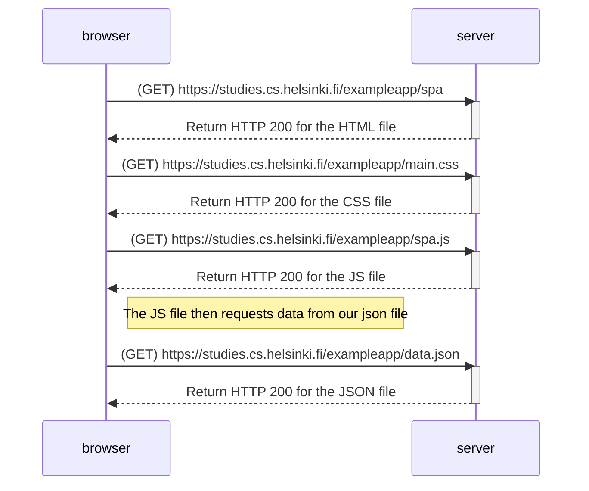

```mermaid
sequenceDiagram
    participant browser
    participant server

    browser->>server: (GET) https://studies.cs.helsinki.fi/exampleapp/spa
    activate server
    server-->>browser: Return HTTP 200 for the HTML file
    deactivate server

    browser->>server: (GET) https://studies.cs.helsinki.fi/exampleapp/main.css
    activate server
    server-->>browser: Return HTTP 200 for the CSS file
    deactivate server

    browser->>server: (GET) https://studies.cs.helsinki.fi/exampleapp/spa.js
    activate server
    server-->>browser: Return HTTP 200 for the JS file
    deactivate server

    Note right of browser: The JS file then requests data from our json file

    browser->>server: (GET) https://studies.cs.helsinki.fi/exampleapp/data.json
    activate server
    server-->>browser: Return HTTP 200 for the JSON file
    deactivate server

```
